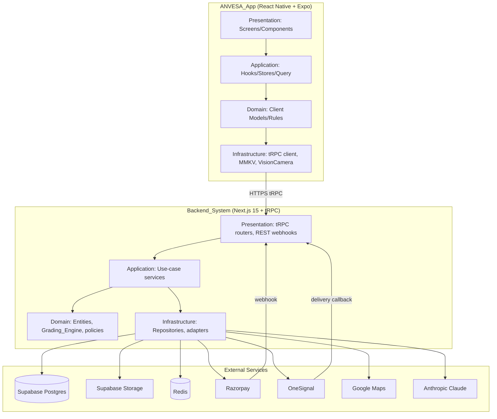
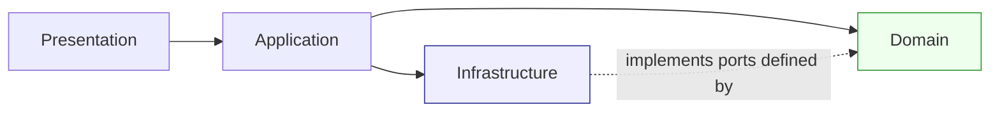
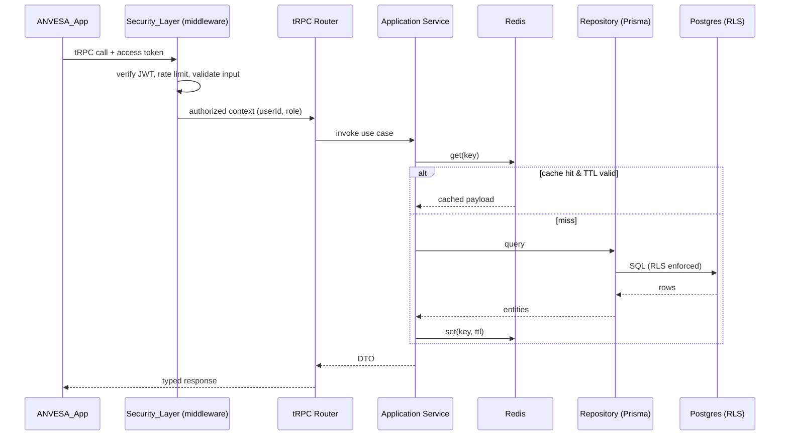
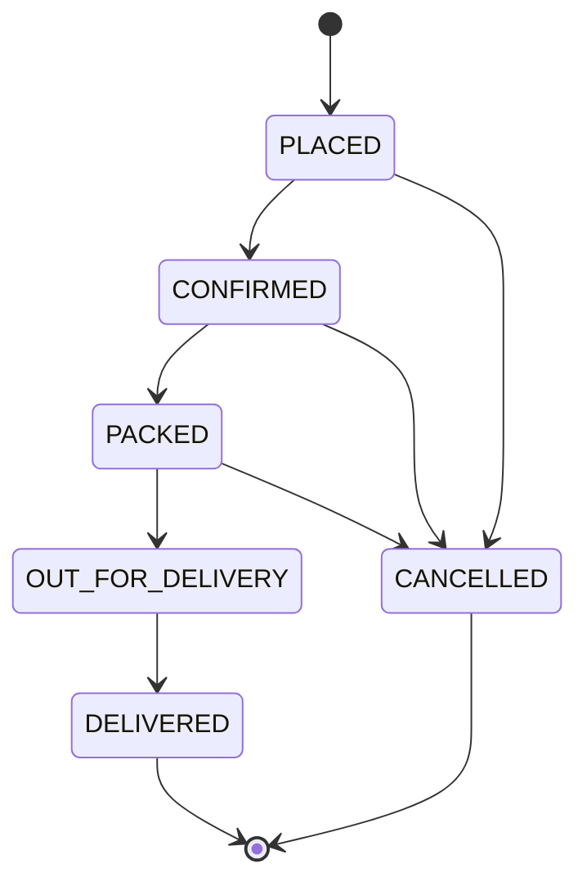
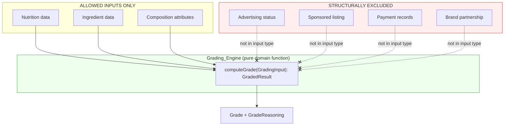
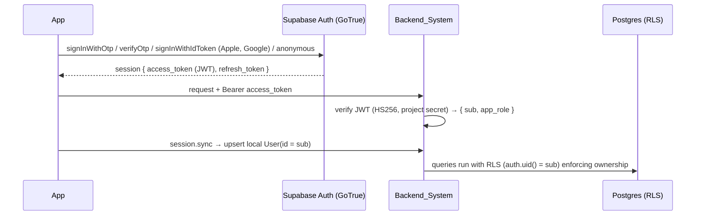

# Design Document

## Overview

ANVESA is a production-ready, enterprise-grade clean-food marketplace built on the principle "Buy what's verified, not what's marketed." It comprises a React Native + Expo mobile client (`ANVESA_App`) and a Next.js 15 + tRPC backend (`Backend_System`) backed by Supabase Postgres/Storage/Auth, Prisma, and Redis. Payments run through Razorpay, notifications through OneSignal, mapping through Google Maps, scanning through Vision Camera (barcode + OCR), and AI analysis through the Anthropic Claude API.

The design is organized around three non-negotiable pillars derived from the requirements:

1. **Grading integrity (Requirement 12, 27.8-27.9, 28.2-28.3).** The `Grading_Engine` computes a product `Grade` *solely* from composition inputs (nutrition, ingredients, composition attributes). Advertising, sponsorship, payment, and partnership signals are structurally unreachable from the grading code path. No caller — user, admin, or vendor — can set or override a grade. Every override attempt is rejected and audited.

2. **Clean Architecture (Requirement 31).** Both client and server separate Presentation → Application → Domain → Infrastructure. Business logic lives in domain/application services, never in components or route handlers. Persistence is reached only through repositories, and external dependencies are injected.

3. **Scale, performance, and trust (Requirements 29, 30).** The system targets millions of users with Redis + client-side caching, cursor pagination, optimistic updates, database indexing, JWT/refresh auth, Row Level Security (RLS), signed upload URLs, rate limiting, schema validation, and audit logging.

This document addresses all 32 requirements. The marketplace is the hero experience; the scanner is one feeder feature among many.

### Scope and Requirement Coverage Map

| Domain | Requirements | Primary Services |
| --- | --- | --- |
| Authentication & session | 1, 2, 3 | Auth_Service |
| Health profile | 4 | Profile_Service |
| Marketplace & product cards | 5, 6, 7 | Marketplace_Service, Cart_Service, Wishlist_Service |
| Product detail & reviews | 8 | Product_Service |
| Search & filters | 9 | Search_Service |
| Scanning | 10 | Scanner_Service, Product_Service |
| AI analysis | 11 | AI_Analysis_Service |
| Grading integrity | 12, 27.8-27.9, 28.2-28.3 | Grading_Engine |
| Cart, coupons, wallet | 13, 14, 15 | Cart_Service, Coupon_Service, Wallet_Service |
| Checkout & payments | 16, 17 | Checkout_Service, Payment_Service |
| Delivery zone & slots | 18, 19 | Delivery_Service, Notification_Service |
| Orders | 20 | Order_Service, Notification_Service |
| Subscriptions | 21 | Subscription_Service |
| Bundles | 22 | Bundle_Service, Cart_Service |
| Rewards, streaks, cashback | 23, 24 | Rewards_Service, Wallet_Service |
| Newsletter | 25 | Newsletter_Service |
| Notifications | 26 | Notification_Service |
| Admin & vendors | 27, 28 | Admin_Panel, Vendor_Service |
| Performance & caching | 29 | Persistence_Layer, all read services |
| Security | 30 | Security_Layer |
| Architecture | 31 | all |
| Design system & accessibility | 32 | ANVESA_App |

## Architecture

### System Context



### Clean Architecture Layering (Requirement 31)

The dependency rule is strict: source-code dependencies point inward only. Inner layers know nothing about outer layers.



- **Domain** (innermost): pure entities and value objects (`Product`, `Grade`, `Cart`, `Wallet`, `Streak`), domain policies, and the `Grading_Engine`. No I/O, no framework imports. Defines repository *ports* (interfaces).
- **Application**: use-case orchestration — the named services (`Marketplace_Service`, `Checkout_Service`, etc.). Depends on domain and on repository ports. Contains transaction boundaries.
- **Infrastructure**: repository *adapters* (Prisma), external gateways (Razorpay, OneSignal, Claude, Google Maps, Supabase Storage), Redis cache. Implements ports declared by the domain.
- **Presentation**: tRPC routers (typed procedures), REST webhook handlers, and — on the client — screens/components.

Dependency injection: a composition root (`server/di/container.ts`) constructs concrete adapters and wires them into application services. Services receive dependencies via constructor injection, keeping them unit-testable with fakes/mocks (Requirement 31.4). Client mirrors this with a lightweight service registry consumed by React Query/Zustand hooks (Requirement 31.2).

### Backend Layer Layout

```
server/
  presentation/        # tRPC routers, webhook route handlers, middleware
  application/          # *_Service use cases (one folder per glossary service)
  domain/               # entities, value objects, grading engine, ports (interfaces)
  infrastructure/       # prisma repositories, gateways, redis, di container
```

### Client Layer Layout

```
app/                    # Expo Router routes (presentation)
src/
  presentation/         # screens, components, design-system
  application/          # hooks, zustand stores, react-query queries/mutations
  domain/               # client-side models + validation (zod), pure rules
  infrastructure/       # trpc client, mmkv storage, vision camera, notifications
```

### Request Lifecycle (typical authenticated read)



### Cross-Cutting Concerns

- **Security_Layer** is implemented as tRPC middleware chains (`publicProcedure`, `protectedProcedure`, `adminProcedure`, `vendorProcedure`) plus Supabase RLS policies at the database. It is the single enforcement point for auth, authorization, rate limiting, validation, signed URLs, and audit logging (Requirement 30).
- **Persistence_Layer** = Prisma + Supabase Postgres for durable state and Redis for cache/ephemeral locks (slot holds, OTP attempts, rate-limit counters).
- **Idempotency**: payment verification, subscription order generation, XP awards, badge grants, and cashback milestones use idempotency keys / unique constraints to guarantee exactly-once effects (Requirements 17, 21, 23, 24).

## Components and Interfaces

This section maps every glossary service to its layer, responsibilities, and public interface. Backend application services are exposed through tRPC routers; each service depends only on domain ports.

### Mobile Client Components (ANVESA_App)

| Component | Layer | Responsibility |
| --- | --- | --- |
| Route screens (`app/(tabs)/marketplace`, `scanner`, `rewards`, `orders`, `profile`) | Presentation | Render the 5 main tabs; delegate all logic to hooks/services |
| Design System (`src/presentation/design-system`) | Presentation | Tokens, `Button`, `Card`, `Input`, `Badge`, `GradeBadge`, `ProductCard`, theming, dark mode (Requirement 32) |
| Query/Mutation hooks (React Query) | Application | Data fetching, cache, optimistic updates, infinite scroll |
| Zustand stores (`authStore`, `cartStore`, `filterStore`) | Application | Client session/UI state |
| Form controllers (React Hook Form + Zod) | Application/Domain | Validated inputs mirroring backend schemas |
| Client domain rules | Domain | Cart math preview, grade display mapping, streak display |
| tRPC client, MMKV persistence, VisionCamera, OneSignal SDK, Google Maps | Infrastructure | Transport, offline cache, scanning, push, geolocation |

Key client behaviors:
- **Offline cache** (Requirement 29.2-29.4): React Query persistence backed by MMKV; images cached via `expo-image` disk cache; offline state shown only when both network and cache are absent.
- **Optimistic updates** (Requirement 6.4-6.5, 29.5): cart/wishlist mutations apply `onMutate` snapshot + rollback in `onError`.
- **Infinite scroll** (Requirement 29.1): FlashList + `useInfiniteQuery` with 20-item pages.

### Backend Application Services

Each service is a class with constructor-injected ports. Interfaces are shown in TypeScript-like pseudocode.

#### Authentication — Supabase Auth (Requirements 1, 2, 3)

Authentication is delegated to **Supabase Auth (GoTrue)**, which provides phone
OTP, Apple, Google, and anonymous (guest) sign-in, plus session and refresh
management out of the box. The ANVESA backend does **not** issue or store tokens;
it verifies the Supabase access token on each request.

```ts
// Backend: verify the Supabase access token and derive the request context.
interface SupabaseJwtVerifier {
  verify(accessToken: string): { userId: string; role: AppRole; email: string | null } | null;
}
// Presentation: a session router mirrors the Supabase user locally.
interface SessionRouter {
  me(): { userId: string | null; role: AppRole | null };                 // R3
  sync(input: { email?: string; phone?: string }): { ok: true };         // ensure local User row
}
```
- The mobile/web client uses the Supabase SDK for OTP / Apple / Google / guest
  sign-in and attaches the resulting access token as a Bearer token.
- The backend verifies the token (HS256 with the project JWT secret). The `sub`
  claim is the canonical user id and equals `auth.uid()` used by RLS, so RLS
  policies enforce ownership directly. App role (CUSTOMER/ADMIN/VENDOR) comes
  from the `app_metadata.app_role` custom claim, defaulting to CUSTOMER.
- On first authenticated action the client calls `session.sync`, which upserts a
  local `User` row keyed by the Supabase uid so downstream foreign keys resolve.
- Guest → account linking (and cart merge that retains the higher quantity per
  variant, Requirement 2.5) uses Supabase anonymous sign-in + identity linking;
  the pure `mergeGuestCart` domain rule remains and is property-tested.

#### Profile_Service (Requirement 4)
```ts
interface ProfileService {
  getProfile(userId: string): Promise<HealthProfile | EmptyProfile>;       // R4.5,4.6
  upsertProfile(userId: string, input: HealthProfileInput): Promise<HealthProfile>; // R4.1-4.3
}
```
Validation ranges: age 1-120, height 30-300cm, weight 1-500kg, gender/activity/diet from enums. Invalid input leaves stored profile unchanged (Requirement 4.2). Stored health conditions feed condition-relevant Red_Flags into product responses (Requirement 4.4).

#### Marketplace_Service (Requirement 5)
```ts
interface MarketplaceService {
  getHomeGroups(): Promise<ProductGroup[]>;                                // R5.1
  getGroupPage(group: GroupKey, cursor?: string): Promise<Page<ProductCard>>; // R5.2,5.3,5.6
}
```
Nine fixed groups. Each `ProductCard` includes image ref, `Grade`, brand, price, discount. Redis-cached with TTL (Requirement 5.4). Cursor pagination, page size configurable (default 20).

#### Product_Service (Requirements 7, 8, 10)
```ts
interface ProductService {
  getDetail(userId: string | null, productId: string): Promise<ProductDetail | NotFound>; // R8.1-8.3,8.5
  getBetterAlternatives(productId: string, limit: number): Promise<ProductCard[]>;        // R8.4,10.4,10.5
  recordView(userId: string, productId: string): Promise<void>;           // R7.2-7.4
  getRecentlyViewed(userId: string): Promise<ProductCard[]>;              // R7.4
  submitReview(userId: string, productId: string, rating: number, text: string): Promise<Review>; // R8.6-8.8
}
```
- `Better_Alternative` = same category, higher `Grade`, ordered highest→lowest, capped at 10 (detail) or 3 (scan). Requirement 8.4/10.4/10.5.
- Recently viewed is a de-duplicated most-recent-first list capped at configured max (Requirement 7.2-7.4).
- Review authorization requires a prior purchase; rating 1-5; text ≤ 2000 chars (Requirement 8.6-8.8).

#### Search_Service (Requirement 9)
```ts
interface SearchService {
  search(query: string, filters: HealthFilter[], cursor?: string): Promise<Page<ProductCard>>;
}
```
Case-insensitive match over name/brand/category. Empty/whitespace query → text match skipped. Filters (Low Sugar, Low Sodium, High Protein, Low Fat, High Fibre, Kids Safe, Diabetic Friendly, Weight Loss, Heart Friendly, Gluten Free) combined by logical conjunction (AND). Excludes inactive-vendor products (Requirement 28.5).

#### Scanner_Service (client) + Product_Service (Requirement 10)
`Scanner_Service` is a client component: captures barcode → lookup by barcode; captures label image → OCR → submit extracted text. On OCR failure, prompts recapture (Requirement 10.3). On barcode no-match with no analysis, offers label capture (Requirement 10.8). Buy-from-ANVESA when alternative is in catalog, else Amazon affiliate link (Requirement 10.6-10.7).

#### Grading_Engine (Requirement 12) — detailed in its own section below.

#### AI_Analysis_Service (Requirement 11)
```ts
interface AiAnalysisService {
  analyze(ingredients: Ingredient[], nutrition: Nutrition, profile?: HealthProfile):
    Promise<{ ingredientAnalysis: string; healthSummary: string } | AnalysisUnavailable>;
}
```
Calls Claude with a 10-second timeout. On error/timeout returns objective Grade + Red_Flag data only, flagged `analysisUnavailable` (Requirement 11.3). **Never mutates the Grade** (Requirement 11.4) — it has no write path to grades.

#### Cart_Service (Requirements 6, 13, 22)
```ts
interface CartService {
  getCart(ownerId: string): Promise<Cart>;
  addItem(ownerId: string, variantId: string, qty: number): Promise<Cart>;   // R6.1,6.6,13.1
  quickAdd(ownerId: string, variantId: string): Promise<Cart>;               // R6.1,6.6
  updateQty(ownerId: string, itemId: string, qty: number): Promise<Cart>;    // R13.2,13.4,13.5
  removeItem(ownerId: string, itemId: string): Promise<Cart>;                // R13.3
  addBundle(ownerId: string, bundleId: string): Promise<Cart>;               // R22.3,22.5
}
```
Stock checks reject over-stock and out-of-stock adds (Requirement 6.6, 13.4). Quantity < 1 rejected (Requirement 13.5). Guest carts persist ≥ 30 days (Requirement 13.6). Bundle add inserts only in-stock products (Requirement 22.5).

#### Coupon_Service (Requirement 14)
```ts
interface CouponService {
  apply(orderId: string, code: string): Promise<OrderTotals>;   // R14.1-14.5
  remove(orderId: string): Promise<OrderTotals>;                // R14.6
}
```
Validates existence, active, not expired, under usage limit, min-order met. Discount capped at subtotal (total never < 0). One coupon per order (Requirement 14.5).

#### Wallet_Service (Requirement 15, 24)
```ts
interface WalletService {
  getWallet(userId: string): Promise<{ balance: number; transactions: WalletTxn[] }>;
  applyToOrder(userId: string, orderId: string, amount: number): Promise<OrderTotals>; // R15.2-15.4
  credit(userId: string, amount: number, reason: string, idempotencyKey: string): Promise<void>; // R15.5,24.6
}
```
Applied amount must be > 0 and ≤ min(balance, outstanding). Transactions record amount, type (credit/debit), timestamp (Requirement 15.6). Cashback credit is idempotent per milestone (Requirement 24.6).

#### Checkout_Service (Requirement 16)
```ts
interface CheckoutService {
  begin(userId: string): Promise<CheckoutSession>;                  // R16.1,16.3
  computeTotals(session: CheckoutSession): OrderTotals;             // R16.2
  place(session: CheckoutSession, paymentResult: PaymentResult): Promise<Order>; // R16.5,16.6
}
```
Requires address + slot + payment method. Total = subtotal − coupon − wallet + delivery, floored at 0. Empty cart blocks placement. Out-of-zone address invokes pincode flow (Requirement 16.4). On payment confirm → create order + clear cart; else retain cart, order unplaced.

#### Payment_Service (Requirement 17)
```ts
interface PaymentService {
  createOrder(amount: number, orderRef: string): Promise<RazorpayOrder>;   // R17.1
  verify(signaturePayload: RazorpaySignature): Promise<PaymentRecord>;     // R17.2-17.5
}
```
HMAC signature verification before success. Failed/unverified → payment failed, cart preserved, order unplaced. Payment record persists amount, status, Razorpay reference.

#### Delivery_Service (Requirements 18, 19)
```ts
interface DeliveryService {
  checkZone(lat: number, lng: number): Promise<{ serviceable: boolean }>;  // R18.1,18.2
  registerPincode(userId: string, pincode: string): Promise<void>;         // R18.3-18.5
  getSlots(addressId: string): Promise<DeliverySlot[]>;                    // R19.1
  reserveSlot(orderId: string, slotId: string): Promise<Reservation>;      // R19.2-19.4
}
```
Haversine distance from CDS Corporate, Cyber Park, Gurugram; ≤ 5 km serviceable. Pincode must be 6-digit numeric; duplicate registrations deduped (Requirement 18.5). Slots for next 7 days with capacity status; reservation holds 10 min (Redis TTL), auto-released on expiry; capacity-full selection rejected.

#### Order_Service (Requirement 20)
```ts
interface OrderService {
  create(session: CheckoutSession): Promise<Order>;                        // R20.1
  transitionStatus(orderId: string, next: OrderStatus, actor: Actor): Promise<Order>; // R20.2,27.4,27.5
  getTracking(userId: string, orderId: string): Promise<OrderTracking>;    // R20.3,20.4
  listOrders(userId: string, cursor?: string): Promise<Page<Order>>;       // R20.6
}
```
Status changes persist timestamped history and trigger notifications (Requirement 20.5). Ownership enforced on tracking (Requirement 20.4). Invalid status transitions rejected via a status state machine (Requirement 27.5).

Order status state machine:


#### Subscription_Service (Requirement 21)
```ts
interface SubscriptionService {
  create(userId: string, items: SubItem[]): Promise<Subscription>;         // R21.1
  generateDueOrders(now: Date): Promise<GeneratedOrder[]>;                 // R21.2,21.3
  pause(id: string): Promise<Subscription>;                                // R21.4
  resume(id: string): Promise<Subscription>;                              // R21.5
  cancel(id: string): Promise<Subscription>;                              // R21.6
}
```
Categories: milk, bread, eggs, vegetables, fruits. 2-day recurring schedule. A scheduled worker generates due orders for active subscriptions, advancing the schedule by 2 days; out-of-stock items are skipped, flagged, and the user notified. Pause suspends, resume continues on next date, cancel stops permanently.

#### Bundle_Service (Requirement 22)
```ts
interface BundleService {
  listBundles(): Promise<BundleView[]>;   // R22.1,22.2,22.4
}
```
Fixed bundles: Weight Loss, High Protein, Kids Nutrition, Gut Friendly, Diabetic, Heart Health. Multi-brand. Availability computed per product; partial availability flags the unavailable product.

#### Rewards_Service (Requirements 23, 24)
```ts
interface RewardsService {
  awardScan(userId: string, productId: string, utcDay: string): Promise<XpResult>;  // R23.1,23.2,24.1-24.3
  awardPurchase(userId: string, orderId: string): Promise<XpResult>;                // R23.3,24.4,24.5
  getLeaderboard(): Promise<LeaderboardEntry[]>;                                     // R23.6
  evaluateBadges(userId: string): Promise<Badge[]>;                                  // R23.4,23.5
}
```
Scan reward deduped per product per UTC day. Badges/achievements granted exactly once via unique constraint. Leaderboard: top 100 by XP desc, ties broken by earliest time XP reached. XP write failure leaves total unchanged (transactional). Streaks increment on consecutive UTC days, reset on a missed day, and are idempotent within a day. Cashback milestone credited exactly once via Wallet_Service.

#### Newsletter_Service (Requirement 25)
```ts
interface NewsletterService {
  listArticles(cursor?: string): Promise<Page<Article>>;   // R25.1 (20/page)
  saveArticle(userId: string, articleId: string): Promise<void>;  // R25.2
  setProgress(userId: string, articleId: string, pct: number): Promise<void>; // R25.3,25.4
  getShareLink(articleId: string): Promise<string>;        // R25.5
  listSaved(userId: string): Promise<Article[]>;           // R25.6
}
```
Progress 0-100 inclusive; out-of-range rejected. Saves deduped. Ordering most-recent-first.

#### Notification_Service (Requirement 26)
```ts
interface NotificationService {
  registerToken(userId: string, token: string): Promise<void>;   // R26.1
  dispatch(userId: string, category: NotifCategory, payload: NotifPayload): Promise<void>; // R26.2,26.4,26.5
  removeInvalidToken(token: string): Promise<void>;               // R26.3
}
```
Tokens deduped per user. Category preferences (order updates, rewards, delivery availability) suppress disabled categories. Dispatch retries up to 3 times, records failure on exhaustion. Invalid tokens removed.

#### Admin_Panel + Vendor_Service (Requirements 27, 28)
Admin CRUD for products, brands, coupons, bundles, articles through backend services with schema validation. Paginated lists default 20, max 50. Order-status transitions validated by the state machine. Analytics aggregates products/orders/customers/XP. Non-admin requests denied by Security_Layer. **Grades are computed by Grading_Engine on nutrition/ingredient submission; manual override rejected and audited.** Vendors submit product data (associated with vendor, graded from composition); direct grade-set attempts rejected and audited; deactivating a vendor excludes its products from marketplace/search/detail.

### Grading_Engine Design (Requirement 12 — Critical Business Rule)

The grading engine is the trust anchor of ANVESA. Integrity is enforced *architecturally* rather than by convention, so that it is structurally impossible for commercial signals to influence a grade.

#### Integrity by construction



1. **Typed input boundary.** `computeGrade` accepts a single `GradingInput` value object containing *only* nutrition, ingredients, and composition attributes. There is no field, parameter, or ambient dependency through which advertising/sponsorship/payment/partnership data can enter. These commercial entities live in separate tables/modules that the grading module does not import (Requirement 12.1, 12.2).

2. **Pure and deterministic.** `computeGrade` is a pure function: no clock, no randomness, no I/O, no database reads. Identical composition inputs always yield the identical `Grade` regardless of brand or listing status (Requirement 12.6). This is the property most valuable to verify with property-based testing.

3. **Exactly one grade.** The function returns exactly one `Grade` from the defined scale (e.g., A/B/C/D) plus structured reasoning factors (Requirement 12.3, 8.3).

4. **No override path.** The `Grade` column is written *only* by a single internal `persistComputedGrade` routine invoked by the engine. No tRPC procedure, admin mutation, or vendor mutation accepts a grade value as input. Any request carrying a grade field is rejected by schema validation and by a dedicated guard, which:
   - rejects the request with an authorization error,
   - leaves the stored grade unchanged,
   - writes an `audit_logs` entry with requester identity, attempted value, and timestamp (Requirement 12.5, 27.9, 28.3).

5. **Recompute on data change.** When nutrition/ingredient/composition data changes (via admin or vendor), the engine recomputes and persists the grade from updated data (Requirement 12.7, 27.8, 28.2). Listing/payment changes never trigger or alter grading (Requirement 12.4).

```ts
// domain/grading — pure, dependency-free
type GradingInput = {
  nutrition: NutritionFacts;          // energy, sugar, sodium, protein, fat, fibre, ...
  ingredients: IngredientRef[];       // additive flags, naturalness, allergens
  composition: CompositionAttributes; // e.g., wholegrain%, processing level
};
type GradedResult = { grade: Grade; reasoning: GradeFactor[]; redFlags: RedFlag[] };

function computeGrade(input: GradingInput): GradedResult; // pure, total, deterministic
```

The application-layer `GradingService` is the only writer of grade rows:
```ts
class GradingService {
  constructor(private products: ProductRepository, private audit: AuditRepository) {}
  async recomputeFor(productId: string): Promise<Grade> { /* read composition, computeGrade, persist */ }
  // No method accepts a grade value. Override attempts are caught by the guard middleware.
}
```

### Authentication & Session Flows (Requirements 1, 2, 3) — Supabase Auth

All sign-in methods and session/refresh handling are provided by Supabase Auth.
The client authenticates with the Supabase SDK; the backend only verifies the
resulting access token and syncs the user locally.



- **OTP / Apple / Google / guest** are handled by Supabase (SMS delivery, code
  validity, attempt limits, rate limiting, and social identity-token
  verification are Supabase responsibilities), satisfying Requirements 1-3.
- **Token lifecycle:** Supabase issues short-lived access tokens and rotates
  refresh tokens automatically; the SDK persists and refreshes the session. The
  backend is stateless — it verifies the access token per request and returns an
  authentication error for missing/expired/invalid tokens.
- **Guest → account linking** uses Supabase anonymous sign-in and identity
  linking; the pure `mergeGuestCart` rule retains the higher quantity per
  variant (Requirement 2.4, 2.5) and is property-tested.
- **Row Level Security** aligns directly with Supabase: policies compare
  `auth.uid()` to the owning `userId`, and the backend service role bypasses RLS
  for trusted server-side workers.

### Caching, Pagination, and Optimistic Updates (Requirement 29)

- **Redis (server):** marketplace groups, product detail, search results keyed by normalized query+filters, and leaderboard cached with per-domain TTLs. Cache-aside pattern; writes invalidate affected keys. Target p95 < 500 ms for cached reads (Requirement 29.6, 29.7).
- **MMKV + React Query (client):** persisted query cache enables offline reads (Requirement 29.3); offline state only when neither network nor cache is available (Requirement 29.4).
- **Image cache:** `expo-image` disk/memory cache serves previously loaded images (Requirement 29.2).
- **Pagination:** cursor-based, 20 items/page, surfaced via `useInfiniteQuery` + FlashList (Requirement 29.1). Admin lists default 20, max 50 (Requirement 27.3).
- **Optimistic updates:** cart/wishlist mutations snapshot and roll back on failure (Requirement 6.4-6.5, 29.5).
- **Indexes:** defined on browse/search/order-lookup columns (Requirement 29.8) — detailed in Data Models.

### Checkout, Payment, and Delivery-Zone Flow (Requirements 16, 17, 18, 19)

```mermaid
sequenceDiagram
    participant App
    participant CO as Checkout_Service
    participant DZ as Delivery_Service
    participant Pay as Payment_Service
    participant RP as Razorpay
    participant Ord as Order_Service

    App->>CO: begin(userId)
    CO->>CO: reject if cart empty
    App->>DZ: checkZone(lat,lng)
    alt outside 5KM zone
        DZ-->>App: unserviceable -> collect pincode
    else serviceable
        App->>DZ: getSlots(); reserveSlot (10-min hold)
        App->>CO: computeTotals (subtotal - coupon - wallet + delivery, floor 0)
        App->>Pay: createOrder(total)
        Pay->>RP: create payment order
        RP-->>App: checkout handled client-side
        App->>Pay: verify(signature)
        alt signature valid
            Pay-->>CO: payment success
            CO->>Ord: create order + clear cart
            Ord-->>App: order confirmation
        else invalid
            Pay-->>CO: verification error (cart preserved, order unplaced)
        end
    end
```

Geofence uses Haversine distance from CDS Corporate, Cyber Park, Gurugram (≤ 5 km serviceable). Slot reservations use Redis TTL keys so unheld slots auto-return to capacity.

## Data Models

The schema is normalized for a large catalog and high transaction volume. Commercial/listing data (payments, sponsorship) is intentionally kept in tables that the grading module does not read, preserving grading integrity at the data layer.

### Entity Relationship Overview

```mermaid
erDiagram
    users ||--o| profiles : has
    users ||--o{ addresses : has
    users ||--o{ orders : places
    users ||--o| wallet : owns
    users ||--o{ device_tokens : registers
    users ||--o{ pincodes : registers
    users ||--o{ scan_history : records
    users ||--o{ saved_products : saves
    users ||--o{ recently_viewed : views
    users ||--o| xp : accrues
    users ||--o| streaks : maintains

    categories ||--o{ products : groups
    brands ||--o{ products : owns
    vendors ||--o{ products : supplies
    products ||--o{ product_images : has
    products ||--o{ product_variants : has
    products ||--o| nutrition : has
    products ||--o{ ingredients : lists
    products ||--o| product_grade : graded_by
    product_grade ||--o{ grade_reasoning : explains
    products ||--o{ product_flags : flagged
    products ||--o{ affiliate_links : links

    orders ||--o{ order_items : contains
    orders ||--o| payments : paid_by
    product_variants ||--o{ order_items : sold_as

    subscriptions ||--o{ subscription_items : contains
    bundles ||--o{ bundle_products : contains
    wallet ||--o{ wallet_transactions : logs
    xp ||--o{ badges : earns
    scan_history ||--o{ scan_rewards : grants
    newsletter_articles ||--o{ saved_products : n/a
```

### Prisma Schema (core models)

```prisma
// ---------- Identity & profile ----------
model User {
  id            String   @id @default(uuid())
  phone         String?  @unique
  email         String?  @unique
  appleSub      String?  @unique
  googleSub     String?  @unique
  isGuest       Boolean  @default(false)
  role          Role     @default(CUSTOMER)   // CUSTOMER | ADMIN | VENDOR
  lastActiveAt  DateTime @default(now())
  createdAt     DateTime @default(now())
  profile       Profile?
  addresses     Address[]
  orders        Order[]
  wallet        Wallet?
  xp            Xp?
  streaks       Streak?
  @@index([phone])
  @@index([email])
}

model Profile {
  id            String  @id @default(uuid())
  userId        String  @unique
  user          User    @relation(fields: [userId], references: [id])
  age           Int     // 1..120
  gender        Gender
  heightCm      Int     // 30..300
  weightKg      Int     // 1..500
  conditions    String[]
  goals         String[]
  activityLevel ActivityLevel
  diet          Diet
  updatedAt     DateTime @updatedAt
}

model RefreshToken {
  id        String   @id @default(uuid())
  userId    String
  tokenHash String   @unique
  revoked   Boolean  @default(false)
  expiresAt DateTime
  createdAt DateTime @default(now())
  @@index([userId])
}

// ---------- Catalog ----------
model Category { id String @id @default(uuid()) key String @unique name String products Product[] }
model Brand    { id String @id @default(uuid()) name String products Product[] }

model Vendor {
  id       String  @id @default(uuid())
  name     String
  isActive Boolean @default(true)      // R28.5 excludes products when false
  products Product[]
  createdAt DateTime @default(now())
}

model Product {
  id           String   @id @default(uuid())
  name         String
  barcode      String?  @unique
  categoryId   String
  brandId      String
  vendorId     String?
  isListed     Boolean  @default(true)   // paid listing visibility (R12.4) - NOT a grading input
  category     Category @relation(fields: [categoryId], references: [id])
  brand        Brand    @relation(fields: [brandId], references: [id])
  vendor       Vendor?  @relation(fields: [vendorId], references: [id])
  images       ProductImage[]
  variants     ProductVariant[]
  nutrition    Nutrition?
  ingredients  Ingredient[]
  grade        ProductGrade?
  flags        ProductFlag[]
  affiliate    AffiliateLink[]
  createdAt    DateTime @default(now())
  @@index([categoryId])          // R29.8 browse
  @@index([brandId])
  @@index([name])                // R9 search
  @@index([vendorId])
}

model ProductImage   { id String @id @default(uuid()) productId String url String position Int }
model ProductVariant {
  id        String @id @default(uuid())
  productId String
  label     String
  priceCents Int
  discountCents Int @default(0)
  stock     Int    @default(0)   // R6.6,R13 stock checks
  product   Product @relation(fields: [productId], references: [id])
  @@index([productId])
}

model Nutrition {
  id String @id @default(uuid()) productId String @unique
  energyKcal Float sugarG Float sodiumMg Float proteinG Float fatG Float fibreG Float
  product Product @relation(fields: [productId], references: [id])
}
model Ingredient {
  id String @id @default(uuid()) productId String name String
  isAdditive Boolean @default(false) isAllergen Boolean @default(false)
  product Product @relation(fields: [productId], references: [id])
  @@index([productId])
}

// Grade is written ONLY by GradingService. No mutation accepts a grade value. (R12)
model ProductGrade {
  id          String   @id @default(uuid())
  productId   String   @unique
  grade       Grade                       // A|B|C|D — exactly one (R12.3)
  computedAt  DateTime @default(now())
  inputHash   String                       // hash of composition inputs for determinism audit
  reasoning   GradeReasoning[]
  product     Product  @relation(fields: [productId], references: [id])
  @@index([grade])   // R8.4 better-alternative ordering
}
model GradeReasoning { id String @id @default(uuid()) gradeId String factor String weight Float detail String }
model ProductFlag    { id String @id @default(uuid()) productId String type String severity String note String @@index([productId]) }
model AffiliateLink  { id String @id @default(uuid()) productId String provider String url String }

// ---------- Cart & commerce ----------
model Cart      { id String @id @default(uuid()) ownerId String @unique isGuest Boolean @default(false) updatedAt DateTime @updatedAt items CartItem[] }
model CartItem  { id String @id @default(uuid()) cartId String variantId String qty Int @@unique([cartId, variantId]) @@index([cartId]) }

model Order {
  id            String   @id @default(uuid())
  userId        String
  status        OrderStatus @default(PLACED)
  subtotalCents Int
  discountCents Int
  walletCents   Int
  deliveryCents Int
  totalCents    Int          // never < 0 (R16.2)
  addressId     String
  slotId        String?
  createdAt     DateTime @default(now())
  items         OrderItem[]
  payment       Payment?
  history       OrderStatusEvent[]
  user          User @relation(fields: [userId], references: [id])
  @@index([userId, createdAt])   // R20.6 + R29.8 order lookup
  @@index([status])
}
model OrderItem        { id String @id @default(uuid()) orderId String variantId String qty Int priceCents Int }
model OrderStatusEvent { id String @id @default(uuid()) orderId String status OrderStatus at DateTime @default(now()) @@index([orderId, at]) }

model Payment {
  id           String  @id @default(uuid())
  orderId      String  @unique
  amountCents  Int
  status       PaymentStatus            // CREATED | SUCCESS | FAILED
  razorpayRef  String?
  signature    String?
  createdAt    DateTime @default(now())
}

model Coupon {
  id          String  @id @default(uuid())
  code        String  @unique
  type        CouponType   // PERCENT | FLAT
  value       Int
  minOrderCents Int @default(0)
  usageLimit  Int
  usedCount   Int @default(0)
  expiresAt   DateTime
  isActive    Boolean @default(true)
}

// ---------- Wallet & rewards ----------
model Wallet            { id String @id @default(uuid()) userId String @unique balanceCents Int @default(0) txns WalletTransaction[] }
model WalletTransaction { id String @id @default(uuid()) walletId String amountCents Int type WalletTxnType at DateTime @default(now()) reason String idempotencyKey String? @@unique([idempotencyKey]) @@index([walletId, at]) }

model Xp     { id String @id @default(uuid()) userId String @unique total Int @default(0) reachedAt DateTime @default(now()) @@index([total]) }
model Badge  { id String @id @default(uuid()) userId String key String grantedAt DateTime @default(now()) @@unique([userId, key]) }  // exactly-once (R23.4)
model Streak {
  id String @id @default(uuid()) userId String @unique
  scanStreak Int @default(0) lastScanDay String?      // UTC yyyy-mm-dd
  purchaseStreak Int @default(0) lastPurchaseDay String?
}

model ScanHistory { id String @id @default(uuid()) userId String productId String utcDay String at DateTime @default(now()) @@index([userId, utcDay]) }
model ScanReward  { id String @id @default(uuid()) userId String productId String utcDay String xpAwarded Int @@unique([userId, productId, utcDay]) }  // dedupe (R23.1,23.2)

// ---------- Subscriptions & bundles ----------
model Subscription     { id String @id @default(uuid()) userId String status SubStatus nextDeliveryAt DateTime items SubscriptionItem[] @@index([status, nextDeliveryAt]) }
model SubscriptionItem { id String @id @default(uuid()) subscriptionId String variantId String qty Int }
model Bundle            { id String @id @default(uuid()) key String @unique name String priceCents Int products BundleProduct[] }
model BundleProduct     { id String @id @default(uuid()) bundleId String productId String }

// ---------- Content & engagement ----------
model NewsletterArticle { id String @id @default(uuid()) title String body String publishedAt DateTime @default(now()) @@index([publishedAt]) }
model SavedProduct      { id String @id @default(uuid()) userId String productId String savedAt DateTime @default(now()) @@unique([userId, productId]) @@index([userId, savedAt]) }
model RecentlyViewed    { id String @id @default(uuid()) userId String productId String viewedAt DateTime @default(now()) @@unique([userId, productId]) @@index([userId, viewedAt]) }
model Feedback          { id String @id @default(uuid()) userId String message String createdAt DateTime @default(now()) }

// ---------- Delivery & notifications ----------
model DeliverySlot { id String @id @default(uuid()) startAt DateTime endAt DateTime capacity Int reserved Int @default(0) @@index([startAt]) }
model Pincode      { id String @id @default(uuid()) userId String code String @@unique([userId, code]) }  // dedupe (R18.5)
model DeviceToken  { id String @id @default(uuid()) userId String token String @@unique([userId, token]) }  // dedupe (R26.1)
model Notification { id String @id @default(uuid()) userId String category String payload Json sentAt DateTime? attempts Int @default(0) @@index([userId]) }

// ---------- Admin & audit ----------
model Admin    { id String @id @default(uuid()) userId String @unique }
model AuditLog {
  id        String   @id @default(uuid())
  actorId   String?
  action    String
  attempted Json?          // e.g., attempted grade value (R12.5)
  at        DateTime @default(now())
  @@index([action, at])
}

enum Role { CUSTOMER ADMIN VENDOR }
enum Grade { A B C D }
enum OrderStatus { PLACED CONFIRMED PACKED OUT_FOR_DELIVERY DELIVERED CANCELLED }
enum PaymentStatus { CREATED SUCCESS FAILED }
enum CouponType { PERCENT FLAT }
enum WalletTxnType { CREDIT DEBIT }
enum SubStatus { ACTIVE PAUSED CANCELLED }
enum Gender { MALE FEMALE OTHER PREFER_NOT_SAY }
enum ActivityLevel { SEDENTARY LIGHT MODERATE ACTIVE VERY_ACTIVE }
enum Diet { VEG NON_VEG VEGAN EGGETARIAN }
```

### Key Indexing Strategy (Requirement 29.8)

- Browse: `Product(categoryId)`, `Product(brandId)`, `ProductVariant(productId)`.
- Search: `Product(name)` (plus Postgres trigram/`pg_trgm` index for case-insensitive contains).
- Grade ordering for alternatives: `ProductGrade(grade)`.
- Order lookup: `Order(userId, createdAt)`, `Order(status)`, `OrderStatusEvent(orderId, at)`.
- Rewards/dedupe: unique `ScanReward(userId, productId, utcDay)`, `Badge(userId, key)`, `WalletTransaction(idempotencyKey)`.
- Leaderboard: `Xp(total)` with `reachedAt` tiebreak.

### Row Level Security (Requirement 30.3)

Supabase RLS policies restrict user-owned tables (`orders`, `wallet`, `profiles`, `addresses`, `saved_products`, `recently_viewed`, `notifications`, `pincodes`, `scan_history`) so a row is readable/writable only by its owning `userId`, with service-role bypass for backend workers. Catalog tables are publicly readable but writable only by admin/vendor roles through the backend.

### tRPC Router Surface

Routers mirror the services one-to-one and are composed into an `appRouter`:

```
appRouter = {
  auth, profile, marketplace, product, search, scanner, ai,
  cart, coupon, wallet, checkout, payment, delivery, order,
  subscription, bundle, rewards, newsletter, notification,
  admin, vendor
}
```
Procedure guards: `publicProcedure` (marketplace/product reads, guest), `protectedProcedure` (owner-scoped), `adminProcedure`, `vendorProcedure`. Razorpay and OneSignal callbacks are REST route handlers (webhooks) outside tRPC, verified by signature.

## Correctness Properties

*A property is a characteristic or behavior that should hold true across all valid executions of a system — essentially, a formal statement about what the system should do. Properties serve as the bridge between human-readable specifications and machine-verifiable correctness guarantees.*

These properties are well suited to property-based testing because the core value — grading integrity — along with the commercial arithmetic (cart, coupon, wallet, checkout), streak/reward logic, pagination, ordering, filtering, geofencing, and validation are all pure, deterministic functions with large input spaces. The properties below were derived from the prework analysis, with redundant criteria consolidated. UI/visual, external-service, and infrastructure criteria are covered by example, integration, and smoke tests instead (see Testing Strategy).

**Grading Integrity (the crown jewel)**

### Property 1: Grade depends only on composition, never on commercial signals
*For any* product composition (nutrition, ingredients, composition attributes), computing the grade twice while arbitrarily varying advertising status, sponsored-listing status, payment records, and brand-partnership status SHALL always produce identical grades.
**Validates: Requirements 12.1, 12.2, 12.4, 12.6**

### Property 2: Every grade is exactly one value from the defined scale
*For any* valid composition input, `computeGrade` SHALL return exactly one grade drawn from the defined grade scale.
**Validates: Requirements 12.3**

### Property 3: Grade override attempts are rejected, leave the grade unchanged, and are audited
*For any* request that attempts to set or override a product grade — regardless of requester role including administrator and vendor — the system SHALL reject the request, retain the computed grade unchanged, and write an audit-log entry containing requester identity, attempted value, and timestamp.
**Validates: Requirements 12.5, 27.9, 28.3, 30.8**

### Property 4: Grade is recomputed and persisted consistently on composition change
*For any* update to a product's nutrition, ingredient, or composition data, the persisted grade SHALL equal `computeGrade` applied to the updated composition inputs.
**Validates: Requirements 12.7, 27.8, 28.2**

### Property 5: AI analysis never alters the grade
*For any* AI analysis response, including malformed or adversarial content, the product's persisted grade SHALL remain equal to the grade computed by the Grading_Engine.
**Validates: Requirements 11.4**

**Money and Commerce Arithmetic**

### Property 6: Cart total invariant
*For any* sequence of add, update-quantity, and remove operations on a cart, the returned cart total SHALL equal the sum over all items of variant price times quantity.
**Validates: Requirements 13.1, 13.2, 13.3**

### Property 7: Invalid cart quantities are rejected without mutating the cart
*For any* quantity that is less than 1 or greater than the variant's available stock, the cart operation SHALL be rejected and the existing cart SHALL remain unchanged.
**Validates: Requirements 6.6, 13.4, 13.5**

### Property 8: Coupon discount is capped and never drives totals negative
*For any* valid coupon applied to any cart, the applied discount SHALL not exceed the cart subtotal and the resulting order total SHALL be greater than or equal to zero.
**Validates: Requirements 14.1**

### Property 9: Ineligible coupons are rejected
*For any* coupon that does not exist, is inactive, is expired, has reached its usage limit, or whose minimum-order condition the cart does not meet, applying it SHALL be rejected with the corresponding error and the order total SHALL remain unchanged.
**Validates: Requirements 14.3, 14.4**

### Property 10: Coupon apply/remove round-trip restores the total
*For any* cart and valid coupon, applying then removing the coupon SHALL restore the order total to its value before the coupon was applied.
**Validates: Requirements 14.6**

### Property 11: Wallet application deducts exactly and records a debit
*For any* wallet amount strictly greater than zero and no greater than the lesser of the available balance and the outstanding total, applying it SHALL reduce the balance by exactly that amount and record a debit transaction with amount, type, and timestamp.
**Validates: Requirements 15.2, 15.6**

### Property 12: Invalid wallet amounts are rejected without changing the balance
*For any* wallet amount that is zero or less, or greater than the available balance, the application SHALL be rejected and the balance SHALL remain unchanged.
**Validates: Requirements 15.3, 15.4**

### Property 13: Cashback credit increases balance exactly and records a credit
*For any* granted cashback amount, the wallet balance SHALL increase by exactly that amount and a credit transaction SHALL be recorded.
**Validates: Requirements 15.5**

### Property 14: Checkout total formula with zero floor
*For any* combination of cart subtotal, applied coupon discount, applied wallet amount, and delivery charge, the order total SHALL equal the maximum of zero and (subtotal − coupon discount − wallet amount + delivery charge).
**Validates: Requirements 16.2**

### Property 15: Confirmed payment creates an order and clears the cart
*For any* checkout whose payment is confirmed, an order SHALL be created and the user's cart SHALL be emptied.
**Validates: Requirements 16.5**

### Property 16: Unconfirmed payment preserves the cart and leaves the order unplaced
*For any* checkout whose payment is not confirmed or whose signature fails verification, the cart SHALL be preserved unchanged, no order SHALL be placed, and a payment record with failed status SHALL be persisted.
**Validates: Requirements 16.6, 17.3, 17.5**

### Property 17: Payment success requires a valid signature
*For any* Razorpay signature payload, the payment SHALL be marked successful if and only if the signature verifies against the expected HMAC.
**Validates: Requirements 17.2**

**Catalog, Search, and Product Views**

### Property 18: Product card completeness
*For any* product returned in a marketplace group, its card DTO SHALL include an image reference, grade, brand name, price, and discount value.
**Validates: Requirements 5.2**

### Property 19: Product detail completeness
*For any* existing product, the detail response SHALL include images, nutrition panel data, ingredient list, grade, grade explanation, grade reasoning factors, red-flag list, better-alternative list, reviews, and related products.
**Validates: Requirements 8.1, 8.3**

### Property 20: Better alternatives are same-category, strictly higher grade, ordered, and capped
*For any* viewed product and catalog, every returned better alternative SHALL belong to the same category and have a strictly higher grade than the viewed product, the list SHALL be ordered from highest to lowest grade, and its length SHALL equal the minimum of the applicable cap (10 on detail, 3 on scan) and the number of available higher-graded products.
**Validates: Requirements 8.4, 10.4, 10.5**

### Property 21: Search text matching is complete and sound
*For any* non-empty query and catalog, the results SHALL include every product whose name, brand, or category contains the query case-insensitively and SHALL exclude every product that does not.
**Validates: Requirements 9.1**

### Property 22: Empty or cleared queries return the unfiltered set
*For any* query consisting only of whitespace, or when all filters are cleared, the service SHALL return the unfiltered result set without applying text matching.
**Validates: Requirements 9.2, 9.5**

### Property 23: Applied filters are satisfied by every result (conjunction)
*For any* set of applied health filters and catalog, every returned product SHALL satisfy every applied filter.
**Validates: Requirements 9.3, 9.4**

### Property 24: Inactive-vendor products are excluded everywhere
*For any* catalog containing products from inactive vendors, those products SHALL NOT appear in marketplace, search, or product-detail responses.
**Validates: Requirements 28.5**

### Property 25: Recently viewed is deduplicated, most-recent-first, and capped
*For any* sequence of product views, the recently-viewed list SHALL contain no duplicate products, SHALL be ordered from most recent to least recent, and SHALL not exceed the configured maximum size.
**Validates: Requirements 7.2, 7.3, 7.4**

**Ordering and Pagination**

### Property 26: Recency-descending ordering
*For any* set of saved products, wallet transactions, orders, or saved articles, the returned list SHALL be ordered from most recent to least recent by the relevant timestamp.
**Validates: Requirements 7.1, 15.1, 20.6, 25.6**

### Property 27: Pagination covers all items with no gaps or duplicates
*For any* list of items and configured page size, concatenating the sequential pages SHALL reproduce the full list in order with no missing items and no duplicates, and no page SHALL exceed the configured size.
**Validates: Requirements 5.3, 25.1, 29.1**

### Property 28: Admin page size is clamped
*For any* requested page size, the effective page size SHALL be the requested value clamped to the range 1 to 50, defaulting to 20 when unspecified.
**Validates: Requirements 27.3**

### Property 29: Order status history is chronologically ordered
*For any* sequence of order status changes, the tracking history SHALL be ordered from earliest to latest with each entry timestamped.
**Validates: Requirements 20.2, 20.3**

### Property 30: Order confirmation completeness
*For any* created order, the confirmation SHALL include the order identifier, items, total, delivery address, and delivery slot.
**Validates: Requirements 20.1**

**Rewards, Streaks, and Engagement**

### Property 31: Scan reward is granted exactly once per product per UTC day
*For any* sequence of scans, XP SHALL be awarded for the first scan of a given product on a given UTC day and SHALL NOT be awarded again for that product on that same UTC day.
**Validates: Requirements 23.1, 23.2**

### Property 32: Consecutive-day streak logic
*For any* sequence of activity days (scan or purchase), the streak value SHALL equal the length of the current run of consecutive UTC calendar days ending on the most recent activity day, SHALL be unchanged by additional activity on an already-counted day, and SHALL reset to zero when a full UTC day passes without activity.
**Validates: Requirements 24.1, 24.2, 24.3, 24.4, 24.5**

### Property 33: One-time grants are idempotent
*For any* trajectory that crosses a badge threshold, achievement condition, or streak cashback milestone, the corresponding badge, achievement, or cashback SHALL be granted exactly once.
**Validates: Requirements 23.4, 23.5, 24.6**

### Property 34: Leaderboard ordering and bound
*For any* set of users, the leaderboard SHALL contain at most 100 entries ordered by descending Satya XP with ties broken by the earliest time the XP total was reached.
**Validates: Requirements 23.6**

### Property 35: Failed XP award leaves the total unchanged
*For any* XP award that fails to record, the user's XP total SHALL remain unchanged.
**Validates: Requirements 23.7**

**Subscriptions and Bundles**

### Property 36: Due active subscriptions generate an order and advance by two days
*For any* active subscription whose scheduled delivery date has been reached, exactly one recurring order SHALL be generated and the next delivery date SHALL advance by two days.
**Validates: Requirements 21.2**

### Property 37: Non-active subscriptions never generate orders
*For any* subscription in paused or cancelled status, no recurring order SHALL be generated at its scheduled date.
**Validates: Requirements 21.4, 21.6**

### Property 38: Bundle add inserts exactly the in-stock subset
*For any* bundle, adding it to the cart SHALL add exactly the subset of bundle products that are in stock; when any product is out of stock the bundle SHALL be flagged partially available and identify the unavailable product.
**Validates: Requirements 22.3, 22.4, 22.5**

**Delivery, Slots, and Pincodes**

### Property 39: Geofence serviceability boundary
*For any* delivery coordinate, the location SHALL be marked serviceable if and only if its great-circle distance from CDS Corporate, Cyber Park, Gurugram is no more than 5 kilometers.
**Validates: Requirements 18.1, 18.2**

### Property 40: Pincode format validation
*For any* pincode input, the submission SHALL be accepted if and only if it is a 6-digit numeric value.
**Validates: Requirements 18.3**

### Property 41: Pincode registration is idempotent per user
*For any* user, registering the same pincode any number of times SHALL result in exactly one registration for that pincode.
**Validates: Requirements 18.4, 18.5**

### Property 42: Delivery slots fall within the next seven days
*For any* returned set of delivery slots, every slot SHALL fall within the next 7 days and expose a start time, end time, and capacity status.
**Validates: Requirements 19.1**

### Property 43: Slot reservation is released on hold expiry
*For any* slot, reserving it and then letting the 10-minute hold elapse without order placement SHALL restore the slot's available capacity to its pre-reservation value.
**Validates: Requirements 19.3**

### Property 44: Full slots reject selection
*For any* slot that has reached capacity, selecting it SHALL be rejected with a slot-full error.
**Validates: Requirements 19.4**

**Authentication and Security**

### Property 45: E.164 phone validation
*For any* phone-number string, the OTP request SHALL be accepted if and only if the string is in valid E.164 format; rejections SHALL identify the phone-number field.
**Validates: Requirements 1.1**

### Property 46: OTP attempt lockout
*For any* sequence of one-time-password submissions against an active code, the active code SHALL be invalidated once five incorrect submissions have occurred.
**Validates: Requirements 1.5**

### Property 47: Request rate limiting by window
*For any* stream of requests from a single subject within a fixed window, requests exceeding the configured threshold (5 OTP requests per 15 minutes; 100 API requests per 60 seconds) SHALL be rejected with a rate-limit error indicating retry-after.
**Validates: Requirements 1.7, 30.6**

### Property 48: Guest cart merge keeps the higher quantity
*For any* two carts, merging a guest cart into an account cart SHALL, for every product variant present in both, retain the higher of the two quantities.
**Validates: Requirements 2.4, 2.5**

### Property 49: Access-token gating
*For any* protected request, access SHALL be granted if and only if the access token is present, well-formed, unexpired, and not revoked.
**Validates: Requirements 30.1, 30.2**

### Property 50: Refresh-token state gating
*For any* refresh token, a new access token SHALL be issued if and only if the refresh token is valid, unexpired, and not revoked.
**Validates: Requirements 3.1, 3.2**

### Property 51: Row-level ownership isolation
*For any* two distinct users, a request by one user for another user's owned data SHALL return only the requester's own data (or be denied), never the other user's rows.
**Validates: Requirements 20.4, 30.3**

### Property 52: Upload validation by size and type
*For any* file-upload request, the upload SHALL be rejected when it exceeds the configured maximum size or is of a disallowed type.
**Validates: Requirements 30.5**

### Property 53: Schema validation rejects malformed payloads
*For any* request payload that violates its schema, the system SHALL reject the request and return a validation error identifying the invalid field.
**Validates: Requirements 27.2, 28.4, 30.7**

**Profiles, Reviews, Notifications, Newsletter**

### Property 54: Health-profile range validation with unchanged prior state
*For any* health-profile submission, it SHALL be accepted and persisted if and only if every field is within its defined range or value set; a rejected submission SHALL leave any previously stored profile unchanged and identify the invalid field.
**Validates: Requirements 4.1, 4.2**

### Property 55: Health-profile update round-trip
*For any* valid health-profile update, a subsequent read SHALL return the most recently written values.
**Validates: Requirements 4.3**

### Property 56: Review authorization and validation
*For any* review submission, it SHALL be persisted if and only if the submitter has purchased the product, the rating is within 1 to 5, and the text length is at most 2000 characters; otherwise it SHALL be rejected with an authorization or validation error accordingly.
**Validates: Requirements 8.6, 8.7, 8.8**

### Property 57: Reading-progress validation and round-trip
*For any* reading-progress value, it SHALL be persisted and returned when within 0 to 100 inclusive and rejected otherwise.
**Validates: Requirements 25.3, 25.4**

### Property 58: Save operations are idempotent
*For any* article or product, saving it any number of times SHALL result in exactly one saved entry for that user.
**Validates: Requirements 25.2, 26.1**

### Property 59: Order-status transition validity
*For any* pair of order statuses, a transition SHALL be accepted if and only if it is an allowed edge in the order status state machine.
**Validates: Requirements 27.5**

### Property 60: Disabled notification categories are suppressed
*For any* user notification preferences, a notifiable event SHALL dispatch a notification if and only if the user has a registered device token and has not disabled that event's category.
**Validates: Requirements 26.2, 26.4**

**Accessibility (computable)**

### Property 61: Theme contrast ratios meet WCAG AA
*For any* text/background color pair used by the design system in light or dark mode, the computed contrast ratio SHALL be at least 4.5:1 for normal text and at least 3:1 for large text and interactive-element boundaries.
**Validates: Requirements 32.3**

### Property 62: Interactive touch-target minimum size
*For any* interactive control in the design system, its rendered touch target SHALL be at least 44 by 44 points.
**Validates: Requirements 32.6**

## Error Handling

### Error Taxonomy

All backend errors are surfaced as typed tRPC errors with a stable `code`, a machine-readable `errorType`, and — for validation — the offending `field`. The client maps these to user-facing states without leaking internals.

| Category | tRPC code | Example errorTypes | Requirements |
| --- | --- | --- | --- |
| Validation | `BAD_REQUEST` | `INVALID_PHONE`, `INVALID_PROFILE_FIELD`, `INVALID_PINCODE`, `INVALID_RATING`, `INVALID_PROGRESS`, `SCHEMA_INVALID` | 1.1, 4.2, 8.8, 13.5, 18.3, 25.4, 27.2, 28.4, 30.7 |
| Authentication | `UNAUTHORIZED` | `OTP_MISMATCH`, `OTP_EXPIRED`, `SOCIAL_TOKEN_INVALID`, `TOKEN_MISSING`, `REFRESH_INVALID` | 1.4, 1.6, 2.6, 3.2, 30.2 |
| Authorization | `FORBIDDEN` | `NOT_OWNER`, `NOT_ADMIN`, `REVIEW_NOT_PURCHASED`, `GRADE_OVERRIDE_DENIED` | 8.7, 12.5, 20.4, 27.7, 27.9, 28.3 |
| Rate limit | `TOO_MANY_REQUESTS` | `OTP_RATE_LIMIT`, `API_RATE_LIMIT` (with `retryAfter`) | 1.7, 30.6 |
| Conflict / state | `CONFLICT` | `OUT_OF_STOCK`, `SLOT_FULL`, `INVALID_STATUS_TRANSITION`, `SINGLE_COUPON_PER_ORDER` | 6.6, 13.4, 14.5, 19.4, 27.5 |
| Not found | `NOT_FOUND` | `PRODUCT_NOT_FOUND`, `COUPON_NOT_FOUND` | 8.2, 14.2 |
| Payment | `PAYMENT_REQUIRED`/`BAD_REQUEST` | `SIGNATURE_INVALID`, `INSUFFICIENT_BALANCE`, `COUPON_INELIGIBLE`, `MIN_ORDER_NOT_MET`, `EMPTY_CART` | 14.3, 14.4, 15.3, 16.3, 17.3 |
| Upstream/degraded | `INTERNAL_SERVER_ERROR`/partial | `AI_UNAVAILABLE`, `OCR_FAILED`, `GROUP_LOAD_FAILED` | 5.5, 10.3, 11.3 |

### Handling Principles

- **Fail closed on integrity, degrade gracefully on enrichment.** Grade override attempts and auth failures fail hard. AI analysis, OCR, and non-critical enrichment degrade to objective data (grade + red flags) with an `unavailable` flag (Requirement 11.3, 10.3).
- **Atomicity for money and rewards.** Cart→order creation, wallet debit/credit, coupon usage increment, and XP/badge/cashback grants run inside database transactions. XP write failure rolls back leaving the total unchanged (Requirement 23.7). Wallet and cashback use idempotency keys (Requirements 15, 24.6).
- **Payment safety.** Signature verification failure marks the payment failed, preserves the cart, and returns the order to unplaced — never a partial order (Requirements 16.6, 17.3, 17.5).
- **Retry with bounds.** Notification dispatch retries up to 3 times, then records the failure (Requirement 26.5). Razorpay/OneSignal webhooks are idempotent by external reference.
- **Client resilience.** Group-level error states offer targeted retry (Requirement 5.5). Offline reads serve cached data; only absent cache shows the offline state (Requirements 29.3, 29.4). Optimistic mutations roll back on rejection (Requirements 6.5, 29.5).
- **Audit on security events.** Every security-relevant action — including denied grade overrides — writes to `audit_logs` with actor, action, attempted value, and timestamp (Requirements 12.5, 30.8).

## Testing Strategy

ANVESA uses a dual approach: **property-based tests** verify universal correctness over large input spaces, and **example / integration / smoke tests** cover concrete scenarios, external services, and configuration. Property tests catch general logic bugs; example tests document specific behaviors and edge cases.

### Property-Based Testing

- **Library:** `fast-check` with Vitest (TypeScript) on the backend for domain/application logic; the same library in the client workspace for design-system contrast/touch-target properties and cart/streak client rules.
- **Do not hand-roll PBT.** Use `fast-check` arbitraries and shrinking.
- **Iterations:** each property test runs a minimum of 100 iterations (`fc.assert(fc.property(...), { numRuns: 100 })`).
- **Tagging:** each property test is tagged with a comment referencing its design property, in the format:
  `// Feature: anvesa-marketplace, Property {number}: {property_text}`
- **One test per property:** each of Properties 1-62 is implemented by a single property-based test.
- **Mocks for cost/isolation:** external gateways (Razorpay, OneSignal, Claude, SMS, Supabase Storage) and the clock/`utcDay` are injected as fakes so pure logic (grading, streaks, geofence, payment signature verification) is tested deterministically at low cost.
- **Custom arbitraries:** `arbComposition` (nutrition + ingredients + composition), `arbCommercialSignals` (ad/sponsor/payment/partnership — used only to prove they don't affect grades), `arbCart`, `arbCoupon`, `arbWallet`, `arbActivityDays`, `arbLatLng`, `arbColorPair`, `arbCatalog`.

Highest-value property suites, in priority order:
1. Grading integrity (Properties 1-5) — the business-critical invariants.
2. Money math (Properties 6-17) — cart, coupon, wallet, checkout, payment.
3. Rewards/streaks (Properties 31-35) — exactly-once and consecutive-day logic.
4. Search/pagination/ordering/alternatives (Properties 18-30).
5. Delivery/auth/security/validation/a11y (Properties 39-62).

### Unit / Example Tests

Focus on concrete scenarios and edge cases not universally quantified:
- OTP success/mismatch/expiry examples (1.3, 1.4, 1.6); social sign-in success (2.1, 2.2); guest 30-day session (2.3); logout revocation (3.3).
- Nine marketplace groups (5.1); six bundles (22.1); empty/not-found states (5.6, 8.2, 8.5, 29.4).
- AI fallback returns grade+flags when Claude fails (11.3); OCR-failure recapture prompt (10.3).
- Single-coupon-per-order (14.5); guest cart persistence (13.6); subscription create/resume (21.1, 21.5).
- Buy-from-ANVESA vs Amazon affiliate selection (10.6, 10.7).

### Integration Tests

Verify external wiring with 1-3 representative examples (not PBT):
- Razorpay order creation and webhook signature round-trip (17.1); OneSignal token registration and dispatch (26.2, 26.3, 26.5); Claude analysis happy path (11.1, 11.2).
- Barcode lookup latency budget (10.1); OCR extraction (10.2); pincode-availability notification fan-out (18.6); order-status notification (20.5); analytics aggregation (27.6).
- Supabase RLS policies enforced at the database (complements Property 51); signed upload URL expiry ≤ 15 min (30.4).
- Cached-read p95 < 500 ms load test (29.7).

### Smoke / Configuration Tests

Single-execution checks:
- Database indexes exist for browse/search/order-lookup columns (29.8).
- Clean Architecture boundaries enforced via `dependency-cruiser` / ESLint import rules: presentation→application→domain→infrastructure only; no persistence access outside repositories; external deps injected (Requirements 31.1-31.4).
- Design-system tokens and dark-mode theme render (32.1, 32.2); screen-reader labels present on interactive elements (32.4); dynamic font scaling to 200% (32.5) via component snapshot/a11y checks.

### CI

GitHub Actions runs: typecheck (strict TS) → ESLint/Prettier → unit + property tests (Vitest + fast-check) → integration tests (ephemeral Postgres + Redis, mocked third parties) → architecture/dependency lint → build. Property test seeds are logged so failing counterexamples are reproducible.
